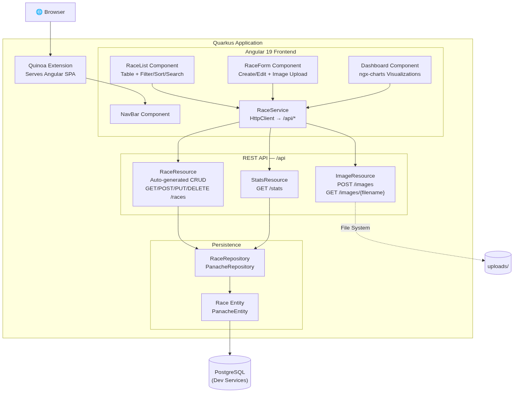

# ⚡ Zelus — Race & Medal Tracker

*Named after Zelus (Ζῆλος), the Greek god of rivalry, zeal, and dedication.*

A full-stack personal race/medal tracker built with **Quarkus** (backend) and **Angular 19** (frontend via Quinoa), backed by **PostgreSQL**.

Track your races, upload medal photos, filter/sort/search your collection, and visualize your achievements with interactive charts.

## Architecture



## Tech Stack

| Layer     | Technology                                      |
|-----------|------------------------------------------------|
| Backend   | Quarkus 3.32, Hibernate ORM Panache, Quarkus REST |
| Frontend  | Angular 19, ngx-charts, Quinoa                  |
| Database  | PostgreSQL (Dev Services for local dev)          |
| API Docs  | SmallRye OpenAPI + Swagger UI                    |

## Prerequisites

- Java 17+
- Maven 3.9+
- Node.js 18+ and npm
- Docker (for PostgreSQL Dev Services)

## Quick Start

```bash
# Clone and run in dev mode (PostgreSQL starts automatically via Dev Services)
mvn quarkus:dev
```

- App: [http://localhost:8080/zelus](http://localhost:8080/zelus)
- Swagger UI: [http://localhost:8080/zelus/q/swagger-ui](http://localhost:8080/zelus/q/swagger-ui)

## Dev Notes

### Root Path & Vite HMR

The app is served under `/zelus` via `quarkus.http.root-path=/zelus`. This creates two dev-mode challenges:

1. **Vite HMR injection** — Angular 19 uses Vite under the hood. In dev mode, Vite injects `<script src="/@vite/client">` as an absolute path, which resolves to `http://localhost:8080/@vite/client` (outside `/zelus`). Fix: `ng serve --serve-path /zelus/` in `package.json` makes Vite inject `/zelus/@vite/client` instead.

2. **Trailing slash redirect** — Quarkus returns 404 for `/zelus` (no trailing slash) while `/zelus/` works. This is a [known Quarkus bug](https://github.com/quarkusio/quarkus/issues/35076). Fix: `TrailingSlashRedirect.java` uses `@Observes Filters` (fires before root-path routing) to 301 redirect `/zelus` → `/zelus/`.

Neither issue affects production builds — Quinoa serves static files directly with no Vite injection.

## Project Structure

```
zelus/
├── pom.xml
├── src/main/java/com/zelus/
│   ├── entity/
│   │   ├── Race.java            # JPA entity
│   │   ├── RaceCategory.java    # Enum: 5K, 10K, HALF_MARATHON, ...
│   │   └── MedalType.java       # Enum: GOLD, SILVER, BRONZE, ...
│   ├── repository/
│   │   └── RaceRepository.java  # Panache repository
│   ├── resource/
│   │   ├── RaceResource.java    # Auto-generated CRUD interface
│   │   ├── ImageResource.java   # Image upload/serve
│   │   ├── StatsResource.java   # Aggregated stats
│   │   └── TrailingSlashRedirect.java  # /zelus → /zelus/ redirect
│   └── dto/
│       └── StatsDTO.java
├── src/main/resources/
│   ├── application.properties
│   └── import.sql               # Sample data
└── src/main/webui/              # Angular 19 app (Quinoa)
    └── src/app/
        ├── components/
        │   ├── race-list/
        │   ├── race-form/
        │   ├── dashboard/
        │   └── nav-bar/
        ├── services/
        │   └── race.service.ts
        └── models/
            └── race.model.ts
```

## Running the Packaged App

In dev mode (`mvn quarkus:dev`), PostgreSQL starts automatically via Dev Services. To run the packaged jar, you need a real database. A `docker-compose.yml` is included for this purpose.

```bash
# 1. Start PostgreSQL
docker compose up -d

# 2. Build the app (if not already built)
mvn package -DskipTests

# 3. Run the jar with datasource config
java \
  -Dquarkus.datasource.jdbc.url=jdbc:postgresql://localhost:5432/zelus \
  -Dquarkus.datasource.username=zelus \
  -Dquarkus.datasource.password=zelus \
  -jar target/quarkus-app/quarkus-run.jar

# 4. Open http://localhost:8080/zelus/

# 5. Stop everything when done
docker compose down
```

### Why this works without a shared Docker network

The Java app runs directly on the host, not inside a container. The `docker-compose.yml` publishes PostgreSQL's port via `ports: "5432:5432"`, which maps the container's port to `localhost:5432` on the host. The JVM connects to `localhost:5432`, Docker forwards the traffic into the PostgreSQL container — no shared Docker network needed.

If the app were also containerized, `localhost` would resolve to the app's own container, not the database. In that case you'd need both services in the same compose file and use the service name (`db`) as the hostname instead.

## API Endpoints

| Method | Path                  | Description                     |
|--------|-----------------------|---------------------------------|
| GET    | /api/races            | List races (paginated, sortable, filterable) |
| GET    | /api/races/{id}       | Get race by ID                  |
| POST   | /api/races            | Create a race                   |
| PUT    | /api/races/{id}       | Update a race                   |
| DELETE | /api/races/{id}       | Delete a race                   |
| GET    | /api/races/count      | Count races                     |
| POST   | /api/images           | Upload medal image              |
| GET    | /api/images/{filename}| Serve medal image               |
| GET    | /api/stats            | Get aggregated statistics       |

### Query Parameters (GET /api/races)

- `page` — Page number (default: 0)
- `size` — Page size (default: 20)
- `sort` — Sort fields, e.g. `sort=-raceDate,name`
- `category` — Filter by category, e.g. `category=MARATHON`
- `medalType` — Filter by medal type
- `name` — Filter by name (exact match)

## Kiro Steerings

This project includes [Kiro](https://kiro.dev) steering files in `.kiro/`:

- `.kiro/steering.md` — Project-specific guidance covering the Quarkus root-path + Angular + Quinoa integration quirks (Vite HMR, trailing slash redirect, base href, API base path).
- `.kiro/steerings/ghcr-container-image.md` — **Reusable** steering for building a Quarkus JVM container image and pushing it to GitHub Container Registry. Includes a Dockerfile, a GitHub Actions workflow (amd64 + arm64), and an "Adapting to a New Project" section for easy copy-paste into other repos.
