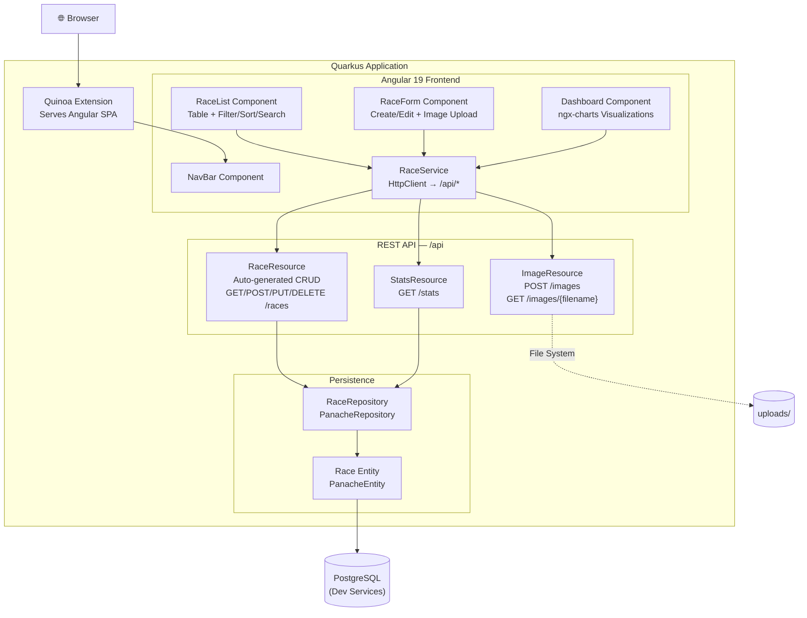

# 🏅 Medallion Quarkus — Race & Medal Tracker

A full-stack personal race/medal tracker built with **Quarkus** (backend) and **Angular 19** (frontend via Quinoa), backed by **PostgreSQL**.

Track your races, upload medal photos, filter/sort/search your collection, and visualize your achievements with interactive charts.

## Architecture



## Tech Stack

| Layer     | Technology                                      |
|-----------|------------------------------------------------|
| Backend   | Quarkus 3.32, Hibernate ORM Panache, Quarkus REST |
| Frontend  | Angular 19, ngx-charts, Quinoa                  |
| Database  | PostgreSQL (Dev Services for local dev)          |
| API Docs  | SmallRye OpenAPI + Swagger UI                    |

## Prerequisites

- Java 17+
- Maven 3.9+
- Node.js 18+ and npm
- Docker (for PostgreSQL Dev Services)

## Quick Start

```bash
# Clone and run in dev mode (PostgreSQL starts automatically via Dev Services)
mvn quarkus:dev
```

- App: [http://localhost:8080](http://localhost:8080)
- Swagger UI: [http://localhost:8080/q/swagger-ui](http://localhost:8080/q/swagger-ui)

## Project Structure

```
medallion-quarkus/
├── pom.xml
├── src/main/java/com/medallion/
│   ├── entity/
│   │   ├── Race.java            # JPA entity
│   │   ├── RaceCategory.java    # Enum: 5K, 10K, HALF_MARATHON, ...
│   │   └── MedalType.java       # Enum: GOLD, SILVER, BRONZE, ...
│   ├── repository/
│   │   └── RaceRepository.java  # Panache repository
│   ├── resource/
│   │   ├── RaceResource.java    # Auto-generated CRUD interface
│   │   ├── ImageResource.java   # Image upload/serve
│   │   └── StatsResource.java   # Aggregated stats
│   └── dto/
│       └── StatsDTO.java
├── src/main/resources/
│   ├── application.properties
│   └── import.sql               # Sample data
└── src/main/webui/              # Angular 19 app (Quinoa)
    └── src/app/
        ├── components/
        │   ├── race-list/
        │   ├── race-form/
        │   ├── dashboard/
        │   └── nav-bar/
        ├── services/
        │   └── race.service.ts
        └── models/
            └── race.model.ts
```

## API Endpoints

| Method | Path                  | Description                     |
|--------|-----------------------|---------------------------------|
| GET    | /api/races            | List races (paginated, sortable, filterable) |
| GET    | /api/races/{id}       | Get race by ID                  |
| POST   | /api/races            | Create a race                   |
| PUT    | /api/races/{id}       | Update a race                   |
| DELETE | /api/races/{id}       | Delete a race                   |
| GET    | /api/races/count      | Count races                     |
| POST   | /api/images           | Upload medal image              |
| GET    | /api/images/{filename}| Serve medal image               |
| GET    | /api/stats            | Get aggregated statistics       |

### Query Parameters (GET /api/races)

- `page` — Page number (default: 0)
- `size` — Page size (default: 20)
- `sort` — Sort fields, e.g. `sort=-raceDate,name`
- `category` — Filter by category, e.g. `category=MARATHON`
- `medalType` — Filter by medal type
- `name` — Filter by name (exact match)
